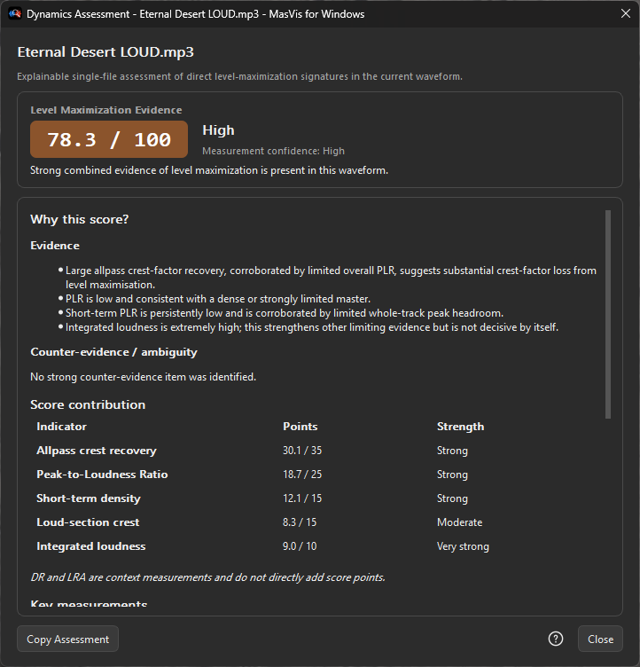

# MasVis for Windows

<p align="center">
  
</p>

**MasVis for Windows** is an independent Windows-native fork of
[MasVisGtk](https://github.com/itprojects/MasVisGtk) by ITProjects. MasVisGtk
builds on PyMasVis by Joakim Fors, a Python reimplementation of the original
MasVis.

MasVis for Windows keeps the proven MasVis/PyMasVis analysis and report concepts
while replacing the GTK/libadwaita desktop interface with a native PySide6/Qt
application for Windows.

> **We don't replace DR. We explain it.**


## Highlights

- Detailed MasVis reports with waveform, spectrum, crest factor, histogram,
  Peak-vs-RMS, EBU R128 loudness and TT-style DR information.
- **Dynamics Assessment**: an explainable 0-100 **Level Maximization Evidence**
  score for a single waveform.
- **Dynamics Comparison**: aligns two versions of substantially the same
  material and separates **Loudness Dynamics Similarity** from
  **Peak Structure Difference** and measured DR.
- Windows-native Light/Dark application theme plus Light/Dark report
  presentation.
- Multiple report tabs, Overview modes, drag & drop, Advanced Open and
  Windows-friendly file dialogs.
- Side-by-side report comparison and configurable animated GIF export.
- High-resolution raster export to PNG, JPEG, WebP and TIFF, plus
  raster-backed SVG, PDF and EPS containers.
- FFmpeg/ffprobe decoding with a fixed, verified FFmpeg 9.0.1 Essentials build
  bundled directly with the portable Windows release.
- Bounded-memory True Peak processing that preserves the validated analysis
  result path while greatly reducing temporary memory use on eligible input.

## Dynamics Assessment

Dynamics Assessment is intended to make common direct level-maximization
signatures easier to inspect instead of reducing the result to one unexplained
number. It combines several deterministic indicators and shows why they
contributed to the final score.



The result is **not** a probability that a track was mastered in a particular
way and **not** a sound-quality grade. DR and LRA are shown as context and do not
directly add score points.

For the frozen v1 methodology, see
[docs/DYNAMICS-ASSESSMENT-V1.md](docs/DYNAMICS-ASSESSMENT-V1.md).

## Dynamics Comparison

Dynamics Comparison is for two versions of substantially the same material. It
aligns the files, level-matches the comparison and keeps three different ideas
separate:

- **Measured DR** — the normal MasVis/TT-style DR result.
- **Loudness Dynamics Similarity** — similarity of the aligned EBU R128
  Short-Term loudness development.
- **Peak Structure Difference** — a separate deterministic score for differences
  in peak/crest structure after alignment and level matching.


### Controlled practical example shown above

The screenshots use two versions of the same user-created track, **Eternal
Desert**. Version B was deliberately made much louder and denser as a controlled
"Loudness War" stress test. In this example the application reports DR 10.4 for
Version A and DR 6.5 for Version B, while Version B is 6.70 dB louder and the
aligned Short-Term loudness analysis strongly favors Version A.

This is an **illustrative validation example**, not proof that MasVis for
Windows can infer mastering history. The comparison only reports what its
measured signals support.

A large measured-DR difference can also coexist with very high Loudness
Dynamics Similarity when most of the difference is concentrated in
peak/crest/transient structure. The application intentionally does not collapse
those dimensions into a single claim of "real" or "fake" dynamics.

For the frozen v1 methodology, see
[docs/DYNAMICS-COMPARISON-V1.md](docs/DYNAMICS-COMPARISON-V1.md).

## Supported audio files

The Windows interface currently accepts these extensions:

`WAV`, `FLAC`, `MP3`, `M4A`, `OGG`, `OPUS`, `AAC`, `AC3`, `AIFF`, `AIF`, `AMR`,
`ALAC`, `PCM`, `WMA`, `APE`

Actual decoding is performed by FFmpeg. A file still has to contain a stream
that the validated FFmpeg build can decode.

## Windows release

The public Windows release is a **portable 64-bit folder packaged as a ZIP**.
Python, PySide6/Qt, NumPy, SciPy, Matplotlib and the remaining tested runtime
dependencies are included.

The release also includes the exact validated **Gyan FFmpeg 9.0.1 Essentials**
`ffmpeg.exe` and `ffprobe.exe` binaries. They are kept inside the portable
application runtime and are used exclusively by the packaged application. No
separate FFmpeg installation, setup helper or PATH configuration is required.

The tested release target is **Windows 11 x64**.

## Running from source

### Requirements

- Windows 11 x64 is the current development/test baseline.
- Python 3.11 or newer; current pinned Windows packaging baseline: Python 3.14.7.
- FFmpeg and ffprobe on `PATH`, or verified local copies under `vendor/ffmpeg/`.

Python dependencies are pinned in `requirements.txt`. Source runs prefer
verified binaries under `vendor/ffmpeg/` when present and otherwise fall back to
`PATH`. Packaged builds use only the verified FFmpeg binaries bundled with the
application and deliberately do not fall back to an arbitrary system FFmpeg.

```powershell
python -m venv .venv
Set-ExecutionPolicy -Scope Process -ExecutionPolicy Bypass
.\.venv\Scripts\Activate.ps1
python -m pip install -r .\requirements.txt
python .\app.py
```

## Project lineage and credit

MasVis for Windows would not exist without the work that came before it:

`MasVis -> PyMasVis -> MasVisGtk -> MasVis for Windows`

- **MasVisGtk** — ITProjects — direct upstream project and analysis/UI basis.
- **PyMasVis** — Joakim Fors — Python reimplementation of the original MasVis.
- **MasVis** — original project/research lineage.

This repository is an independent derivative/fork of MasVisGtk and links back
to the upstream project explicitly. MasVis for Windows is developed
independently and is **not an official MasVisGtk release**.

Project direction, feature design, testing, and release decisions: **adventureFAN**.
Most implementation, debugging, and technical documentation: developed collaboratively with **ChatGPT**.

## License and third-party software

MasVis for Windows is distributed under the **GNU General Public License,
version 3 or (at your option) any later version** (`GPL-3.0-or-later`). See
[`LICENSE`](LICENSE).

Reused or modified upstream source retains its original copyright notices. The
Windows fork's first-party modifications are Copyright (C) 2026 adventureFAN.

Packaged releases also contain third-party runtime components under their own
licenses, including Qt for Python/PySide6 and the validated GPLv3 Gyan FFmpeg
9.0.1 Essentials build. See [`THIRD_PARTY_NOTICES.md`](THIRD_PARTY_NOTICES.md)
for attribution, exact build identity and source-access information.

## Repository

- Project: https://github.com/adventureFAN/MasVis-for-Windows
- Upstream: https://github.com/itprojects/MasVisGtk
